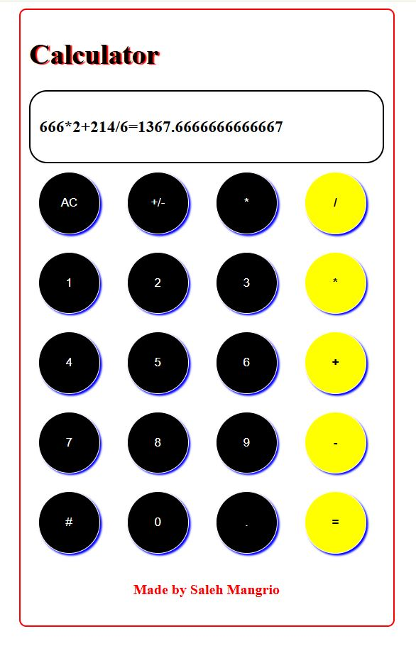

<h1 style="color:red;">CALCULATOR using HTML, CSS, JAVASCRIPT</h1>


A simple and stylish web-based calculator built with HTML, CSS, and JavaScript. This calculator allows users to perform basic arithmetic operations like addition, subtraction, multiplication, division, and supports floating-point numbers. The design is user-friendly and visually appealing.

## Features

- **Basic Arithmetic Operations**: Addition, subtraction, multiplication, and division.
- **Clean and User-Friendly Interface**: The buttons are large and easy to click/tap.
- **Responsive Design**: Works on both mobile and desktop devices.
- **Clear and Reset Functionality**: Clear the screen and reset calculations easily.
- **Error Handling**: Displays an error message if an invalid operation is attempted.

## Technologies Used

- **HTML**: Used for creating the structure of the app.
- **CSS**: For styling and making the app visually appealing.
- **JavaScript**: To handle calculator logic and user interactions.

## Getting Started

### Prerequisites

Make sure you have the following installed on your system:

- A modern web browser (Chrome, Firefox, Safari, etc.)
- A text editor (e.g., Visual Studio Code, Sublime Text)
- A local server (optional, if you want to run it locally)

### Installation

To get started with this project locally, follow these steps:

1. **Clone the repository:**
   ```bash
   git clone https://github.com/Salehmangrio/CALCULATOR_HTML_CSS_JAVASCRIPT_SALEH.git
   ```

2. **Navigate to the project directory:**
   ```bash
   cd CALCULATOR_HTML_CSS_JAVASCRIPT_SALEH
   ```

3. **Open the `index.html` file in your web browser.**

   You can open it directly by double-clicking the `index.html` file or by serving it with a local server if you're familiar with one.

   Alternatively, you can also use live preview features in editors like VS Code.

## Usage

1. **Click on the buttons** to input numbers and operators.
2. **Press "="** to calculate the result of the expression.
3. **Press "AC"** to clear the screen and reset the calculator.

## Code Overview

The project consists of three main files:

### `index.html`

- Contains the structure of the calculator, including buttons and display area.
- JavaScript functions are linked to the buttons for interactive behavior.

### `calculator.css`

- Provides styling for the app, including button design, layout, and visual effects like hover states.
- Uses grid layout to arrange the buttons neatly.

### `calculator.js`

- Handles the functionality of the calculator.
- The `clr()` function clears the display.
- The `callStr()` function updates the current input.
- The `calculate()` function evaluates the current input and displays the result.

## Example of Calculator in Action

- **Input**: `5 + 3 * 2`
- **Result**: `5 + 3 * 2 = 11`

## Contributing

Feel free to fork this repository, clone it to your local machine, and make improvements! If you would like to contribute, please follow these steps:

1. Fork the repository.
2. Create a new branch for your feature or fix.
3. Commit your changes.
4. Push to your forked repository.
5. Create a pull request.

## Acknowledgements

- The idea for this calculator was inspired by simple web-based tools and was created for learning purposes.
- A big thanks to all the contributors who make open-source projects amazing!

## CALCULATOR VIEW
<br>
<br>
<br>
<p align="center">
  
</p>


## Contact

Created by **Saleh Mangrio**  
You can reach me via: 
- EMAIL: [salehmangrio114@gmail.com](mailto:salehmangrio114@gmail.com) 
- GITHUB: [github.com/salehmangrio](https://github.com/salehmangrio)
- LINKEDIN: [linkedin.com/in/salehmuhammad114](www.linkedin.com/in/salehmuhammad114)
